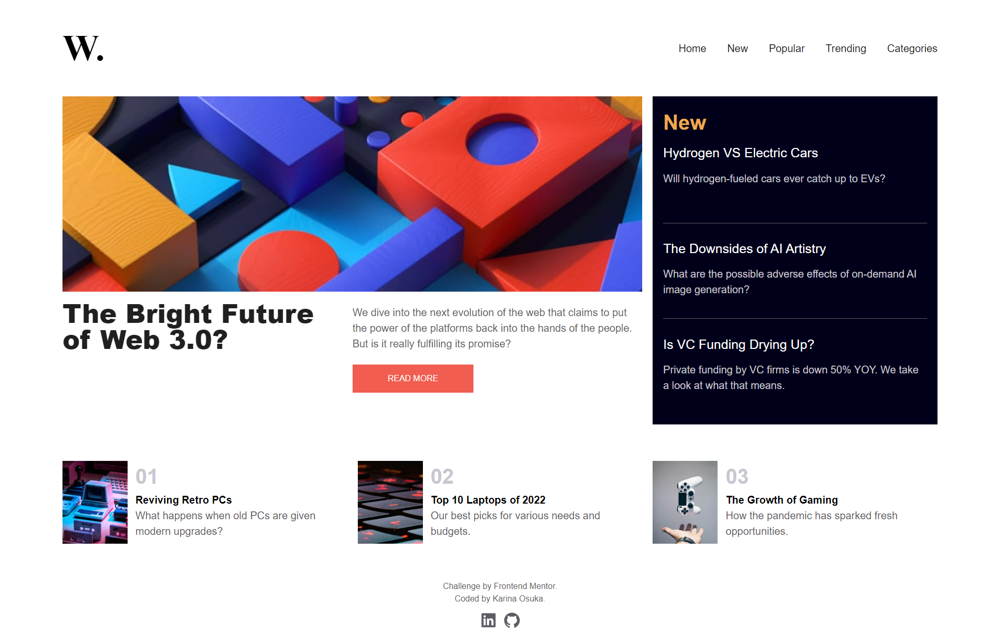

# Frontend Mentor - News homepage solution

This is a solution to the [News homepage challenge on Frontend Mentor](https://www.frontendmentor.io/challenges/news-homepage-H6SWTa1MFl). Frontend Mentor challenges help you improve your coding skills by building realistic projects.

## Table of contents

- [Overview](#overview)
  - [The challenge](#the-challenge)
  - [Screenshot](#screenshot)
  - [Links](#links)
- [My process](#my-process)
  - [Built with](#built-with)
- [Author](#author)

## Overview

### The challenge

Users should be able to:

- View the optimal layout for the interface depending on their device's screen size
- See hover and focus states for all interactive elements on the page
- **Bonus**: Toggle the mobile menu (requires some JavaScript)

### Screenshot

### Links

- Solution URL: [Github](https://github.com/kari-osk/frontendmentor-news-homepage)
- Live Site URL: [Page](https://kari-osk.github.io/frontendmentor-news-homepage/)

## My process

### Built with

- Mobile-first workflow
- Semantic HTML5 markup
- [React](https://reactjs.org/) - JS library
- [React Router DOM](https://www.npmjs.com/package/react-router-dom) - React framework
- [Phosphor-react](https://www.npmjs.com/package/phosphor-react) - Icons
- [Ant Design](https://ant.design/components/icon/) - Icons
- [TailwindCss](https://tailwindcss.com/) - For styles

## Author

- Linkedin - [Karina Osuka](www.linkedin.com/in/karinaosuka)
- Frontend Mentor - [@kari-osk](https://www.frontendmentor.io/profile/kari-osk)
